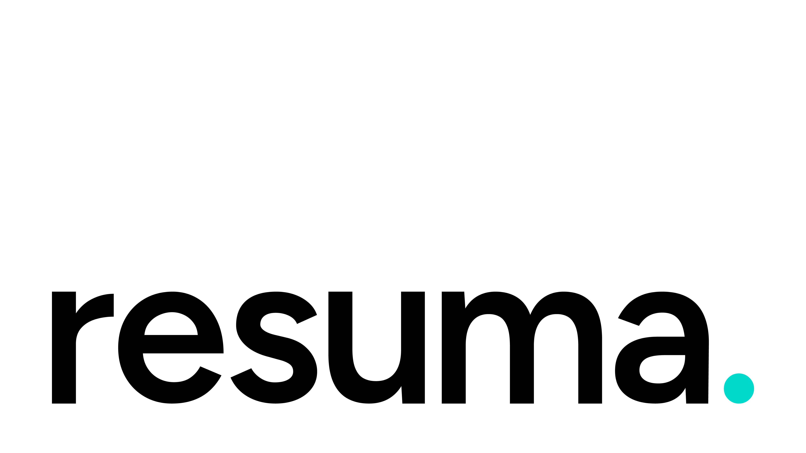

# 


Resuma is an open-source desktop application for building beautiful, professional resumes using local AI models. Your data never leaves your device.

Powered by Tauri, Rust, React (TSX), and llama.cpp, Resuma brings the power of private AI directly to your desktop, ensuring fast performance and complete privacy.

> ⚡ **Offline and private**: No external servers, complete control over your data.

> ⚡ **Cross-platform**: Works on Windows, macOS, and Linux.

## 💖 Support

[](https://www.buymeacoffee.com/nikolchaa)

## 🔧 Features

- ✍️ Offline AI resume writing
- 📂 Full local data storage (no external servers)
- ✨ Elegant onboarding and user experience
- ⚙️ Advanced model configuration (mmap, mlock, gpu_layers, context size, etc.)
- 👨‍💼 Customizable personal information, education, projects, skills, and more
- 📄 Dynamic PDF generation with LaTeX-inspired layouts
- 🖋️ AI-powered resume section enhancement and trimming based on job descriptions
- 🧠 Local AI processing for resume tailoring, keyword optimization, and ATS-friendly formatting
- 🖼️ PDF preview with page splitting and dynamic layout adjustments
- 🛠️ Supports multiple local models and hardware backends (CPU, CUDA, HIP, Vulkan)
- 🚀 Cross-platform support: Windows, macOS, and Linux
- 🔍 Advanced search and filtering for resume entries
- 🎨 Theming support with light/dark modes
- 🧱 Modular and extendable architecture for future features
- 🧑‍💻 Developer-friendly setup with clear code structure and CLI integration
- 🔐 Secure by design: no telemetry and no analytics.

## 📦 Installation

### Option 1: Official Installer (Recommended)

Visit [resuma.download](https://resuma.download) or the [GitHub Releases page](https://github.com/nikolchaa/resuma/releases) to download the latest stable version.

### Option 2: Bleeding Edge (Development Builds)

Clone and run the latest development version directly from GitHub:

```bash
git clone https://github.com/nikolchaa/resuma.git
cd resuma
npm install
npm run tauri dev
```

> **Note:** Development builds may contain experimental features. Make sure you have Rust and Tauri prerequisites installed. See the [Tauri setup guide](https://v2.tauri.app/start/prerequisites/).

## 🔒 License

This project is licensed under the [GNU GPLv3 License](./LICENSE).

```text
Resuma - AI-Powered Resume Builder
Copyright (C) 2025  Nikola Ranđelović

This program is free software: you can redistribute it and/or modify
it under the terms of the GNU General Public License as published by
the Free Software Foundation, either version 3 of the License, or
(at your option) any later version.

This program is distributed in the hope that it will be useful,
but WITHOUT ANY WARRANTY; without even the implied warranty of
MERCHANTABILITY or FITNESS FOR A PARTICULAR PURPOSE. See the
GNU General Public License for more details.

You should have received a copy of the GNU General Public License
along with this program. If not, see <https://www.gnu.org/licenses/>.
```

"Resuma™" and the Resuma™ logo are trademarks of Nikola Ranđelović. Please see the [Trademark Policy](./TRADEMARK.md) for details.

## 📧 Contact

Questions, ideas, or contributions? Reach out to us at [contact@nikolchaa.com](mailto:contact@nikolchaa.com).

## 📄 Legal

- [Terms of Service](./TERMS.md)
- [Privacy Policy](./PRIVACY.md)
- [Third-Party Software Disclosure](./THIRD_PARTY.md)
